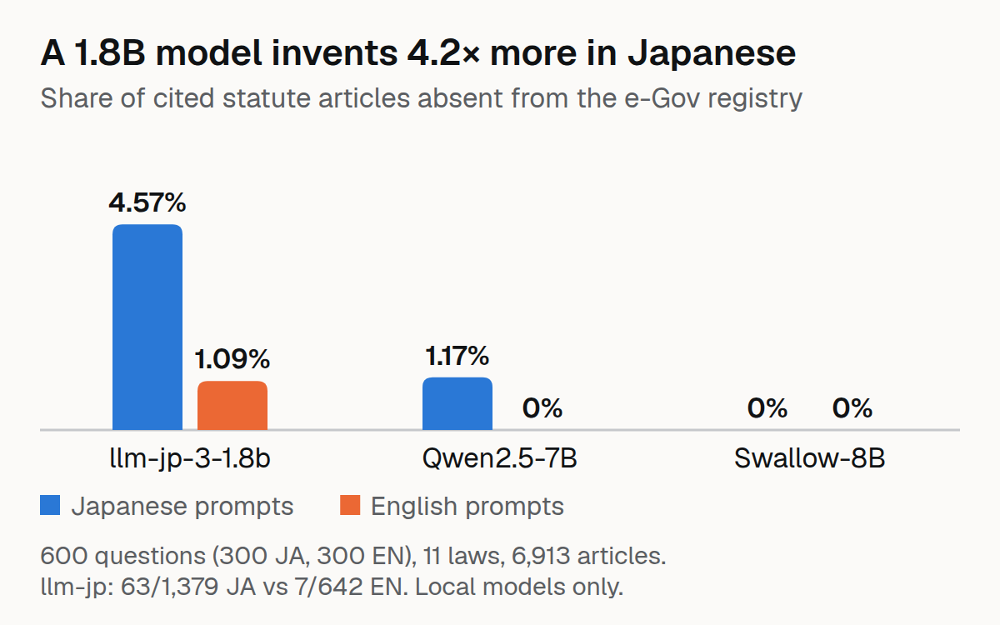

# JaCite-Bench



Write-up: [Do LLMs Invent Japanese Law Articles? A Bilingual Benchmark](https://dev.to/raihan-js/do-llms-invent-japanese-law-articles-a-bilingual-benchmark-42l7)

Do LLMs invent Japanese law articles? A bilingual benchmark that checks every statute article an LLM cites against the official e-Gov law registry.

## The problem

LLMs cite Japanese law articles in their answers. But do those articles actually exist? Most Japanese LLM evals score answers against gold labels. This one checks grounding against a symbolic source of truth — the e-Gov Law API v2.

## The approach

1. **Registry**: Pull 11 commonly cited laws (民法, 会社法, 労働基準法, etc.) from e-Gov API v2 into a versioned registry of 6,913 articles
2. **Normaliser**: Map kanji numerals (第五百四十一条 → 541), の-branch numbers (第四百十五条の二 → 415-2), and English forms (Article 541 → 541) to one canonical ID
3. **Questions**: Generate 300 questions per language from official article captions — each with a known gold article
4. **Benchmark**: 3 local LLMs answer every question in both languages; every cited article is resolved against the registry

## Results

> **Correction, 2026-10-06.** The first release's citation extractor reported the prefix of every branch citation as a second, phantom citation (第二条の二 gave both "2-2" and "2"). That inflated the number of citations in Japanese answers (llm-jp 1,554 → 1,379 mentions, Qwen2.5-7B 643 → 597, Swallow-8B 793 → 753; English unchanged) and counted 2 phantom citations of Qwen as invented. **Corrected:** llm-jp JA 4.05% → 4.57% (JA/EN ratio 3.7× → 4.2×), Qwen2.5-7B JA 1.40% (9/643) → 1.17% (7/597), Swallow-8B unchanged at 0; the gold-hit counts below are unchanged, and so are the conclusions. Found while building another project that reuses the extractor. `scripts/rescore.py` reproduces the first release's recorded counts exactly and the corrected ones from the published responses.
>
> **What "exists" means here.** The registry lists 6,913 articles, which includes supplementary provisions (附則) and deleted placeholders ("削除"); it holds 4,842 distinct canonical ids. A citation of a deleted article such as 民法第208条 or 第516条 therefore counts as real. If deleted placeholders are treated as non-existent (a registry built from the main provisions only), the counts become 66/1,379 (llm-jp, JA), 12/597 (Qwen2.5-7B, JA) and 2/753 (Swallow-8B, JA); the English counts do not change. None of those ten extra mentions is an explicit 附則 citation.

| Model | JA invented | EN invented | JA rate | EN rate |
|---|---|---|---|---|
| llm-jp-3-1.8b | 63/1,379 | 7/642 | **4.57%** | **1.09%** |
| Swallow-8B | 0/753 | 0/670 | 0.00% | 0.00% |
| Qwen2.5-7B | 7/597 | 0/567 | **1.17%** | 0.00% |

**Two of the three local models invent Japanese law articles more often when asked in Japanese.** The llm-jp model's JA rate is 4.2× its EN rate; Qwen2.5-7B shows the same direction (1.17% vs 0%). Swallow-8B, a Japanese-adapted Llama, invents none in either language (under the registry definition above; 2 of 753 Japanese mentions if deleted placeholders are excluded).

### Uncertainty

Wilson 95% intervals and Fisher exact tests on the citation counts (rate = invented mentions / all cited mentions; a citation repeated in an answer counts each time):

| Model | JA invented | EN invented | JA 95% CI | EN 95% CI | Fisher p, JA vs EN |
|---|---|---|---|---|---|
| llm-jp-3-1.8b | 63/1,379 | 7/642 | [3.6%, 5.8%] | [0.5%, 2.2%] | 2.1e-5 |
| Qwen2.5-7B | 7/597 | 0/567 | [0.6%, 2.4%] | [0.0%, 0.7%] | 0.016 |
| Swallow-8B | 0/753 | 0/670 | [0.0%, 0.5%] | [0.0%, 0.6%] | n/a |

These treat each cited article as independent. Citations cluster within answers (300 questions per language), so the intervals and p-values are optimistic; a question-level bootstrap is the stricter test. The denominators differ because models cite more articles when answering in Japanese (1,379 vs 642 for llm-jp).

### Did it cite the gold article?

Share of questions where the cited articles include the gold article (from `benchmark.json`):

| Model | JA | EN |
|---|---|---|
| llm-jp-3-1.8b | 292/300 (97.3%) | 298/300 (99.3%) |
| Qwen2.5-7B | 273/300 (91.0%) | 300/300 (100%) |
| Swallow-8B | 300/300 (100%) | 300/300 (100%) |

The `real_not_gold` field in the dataset also records citations that exist in the registry but are not the gold article, so a "real but wrong" rate can be reported from the same data.

## Key findings

1. **Language matters**: JA prompts produce more invented citations than EN prompts for 2 of 3 models
2. **Size is not the whole story**: the 1.8B model has the highest JA rate and the 8B Japanese-adapted model has 0%, but the models also differ in training data, so this is not a clean size comparison
3. **The normaliser is the hard part**: Kanji numerals, の-branch numbers, and English forms must all map to one canonical ID, and a branch citation must stay one citation (the first release got this wrong; see the correction above)
4. **Caption-generated questions have a known gold article** without needing a legal expert, at the price of being easier than real questions

## Limitations

- Checks that an article exists, not whether the legal reasoning is right; a deleted article (削除) counts as existing, and the rates are per mention, not per answer
- Questions are template-generated from captions — easier and less natural than real use
- 3 local models only; no frontier API baselines
- Questions are generated from official article captions, not written by a legal expert

## Usage

```bash
# Build registry
PYTHONPATH=src python -m jacite.registry

# Generate questions
PYTHONPATH=src python -m jacite.questions

# Run benchmark
PYTHONPATH=src python scripts/run_benchmark.py
```

## License

MIT
